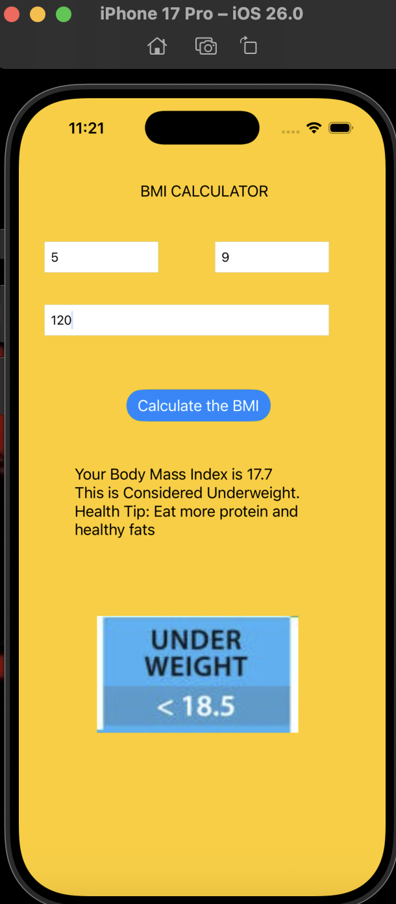
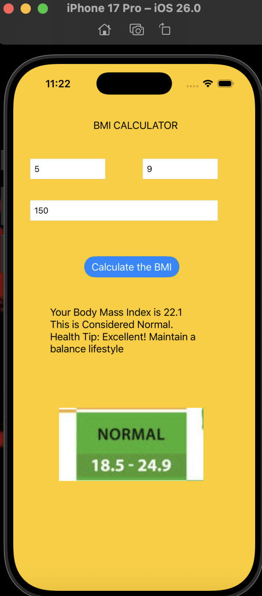
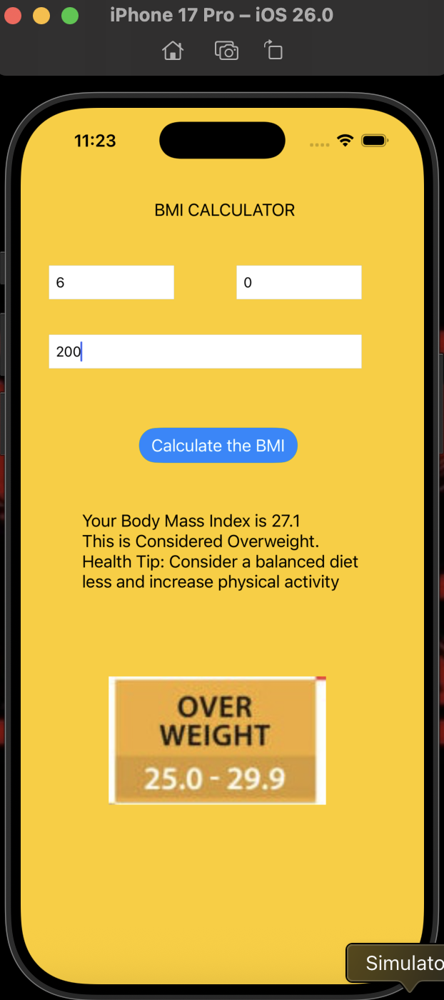
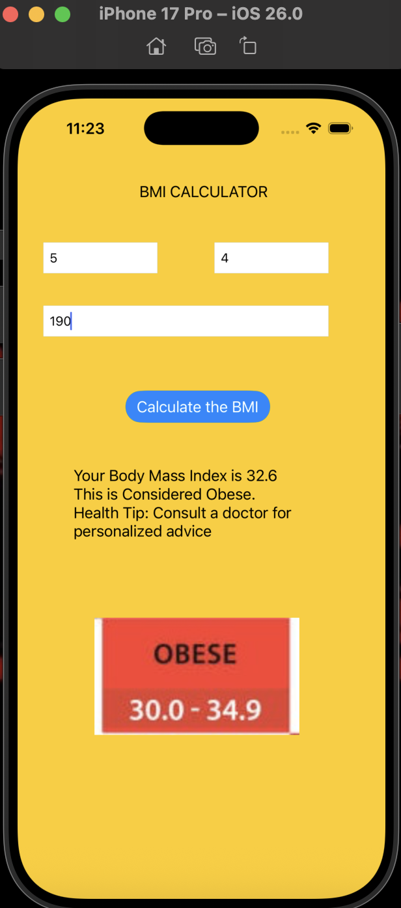

# 📱 iOS App - BMI Calculator

A simple **Body Mass Index (BMI) Calculator** iOS app built in **Swift (UIKit)**.  

---

## ✨ Features

- Input height (feet + inches) and weight (lbs).
- Calculates **BMI** instantly.
- Shows **BMI category** (Underweight, Normal, Overweight, Obese).
- Provides **health tips** for each category.
- Displays **visual feedback images** for clarity.

---

## 🛠️ Technologies Used

- Swift
- UIKit

---

## 📸 Screenshots

### Underweight

### Normal

### Overweight

### Obese

---

## 👨‍💻 Author

**Venkata Chandresh Adapa**
